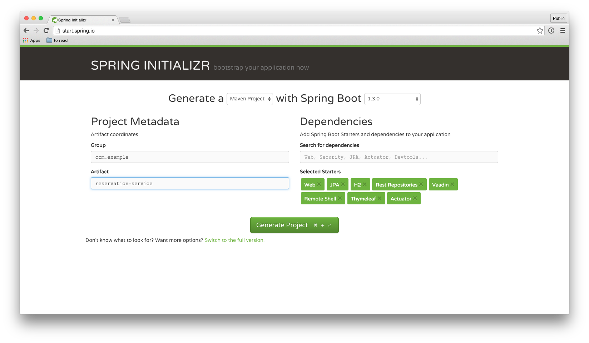
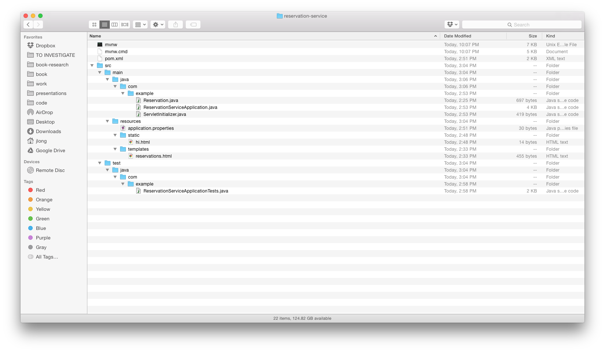
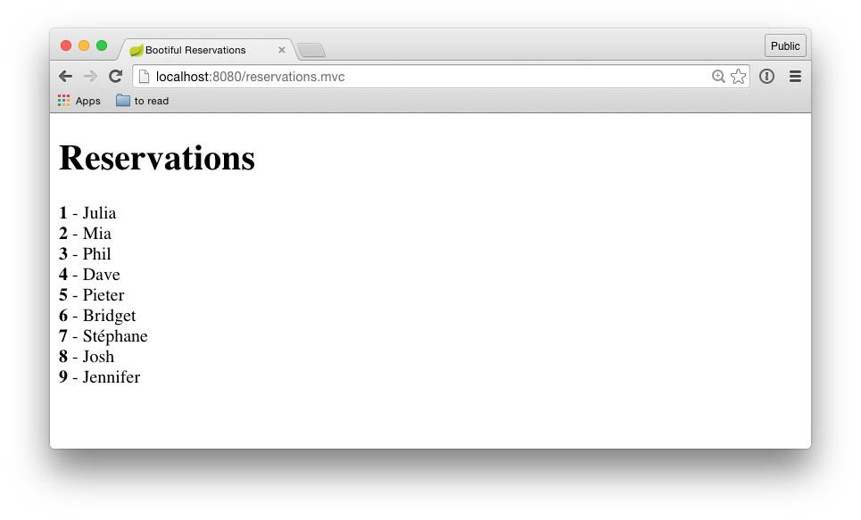
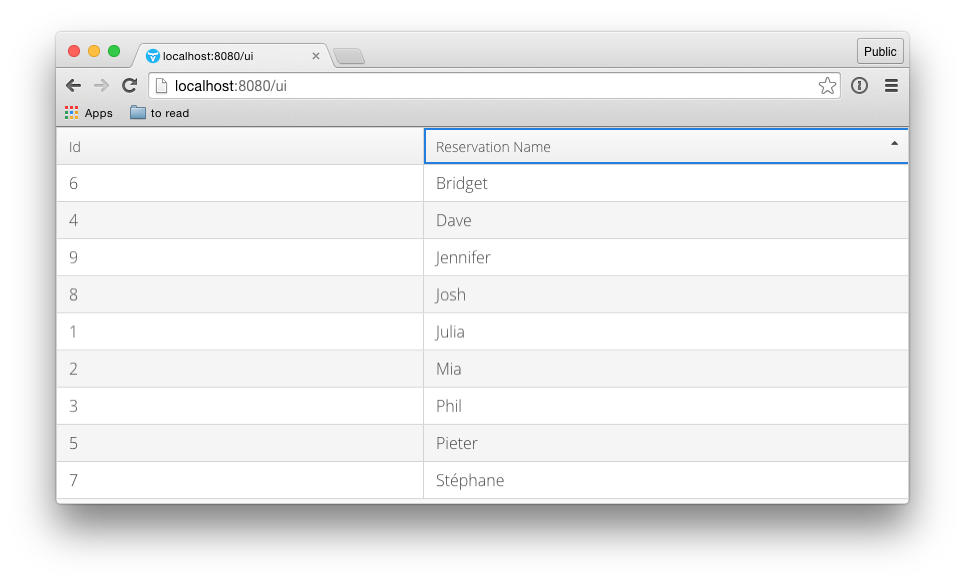
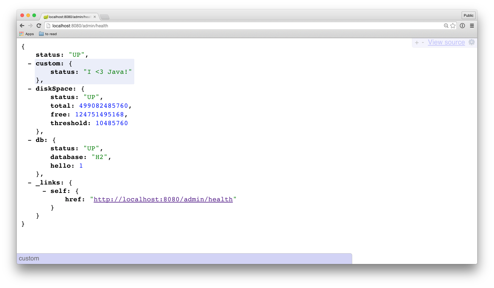

# Your First Steps with Spring Boot 

[Spring Boot](http://spring.io/projects/spring-boot) is an opinionated way to quickly build software intended for production. It pulls together and integrates lots of great technologies including Spring and Java EE.

## Getting Started

There are many ways to get started with Spring Boot. My favorite is [the Spring Initializer](http://start.spring.io). The Spring Initializr is a webservice you can use directly or from wizards inside your favorite IDEs (Spring Tool Suite, Netbeans or IntelliJ IDEA 14 Professional). All of these different IDE integrations ultimately delegate to the Spring Initializr webservice. Whatever your approach, you'll be shown a menu of checkboxes. Choose what type of workloads and technologies you'd like to work with. You can choose what type of packaging you'd like: `.jar` or `.war`. You can choose a language, Java or Groovy. You can also choose which version of JVM you'd like to use: 1.6 through 1.8. Whenever possible, choose 1.8 as the other two are end-of-life'd. Java 1.8 is an amazingly cool language, and makes application development a breeze.

This article going to look at lots of different technologies - we won't focus on any one thing. The goal is instead to highlight just how easy it is to pull together a useful application. Let's call it a "kitchen sink" tour! In our example, we'll choose `Web`, `JPA`, `Rest repositories`, `Vaadin`, `Actuator`, `Remote Shell`, `H2`, and `Thymeleaf`. Click _Generate Project_ to download a `.zip` file that you can open in your favorite IDE.



When you open the project, you'll see that there's simple `public static void main` method and an empty unit test. You'll also find two empty directories - `static` and `templates` in the `src/main/resources` directory. Templates that are processed on the server side, like Freemarker, Velocity, Thymeleaf, etc., live in the `templates` directory. Assets that will be sent to the client directly - JavaScript, images, CSS, etc. - live in the `static` directory. In the image below, I've shown the directory complete with a sample Thymeleaf template - `reservations.html` -  and a simple `hi.html` file to be sent to an HTTP client unprocessed.



Open the `pom.xml` build file. You'll see that this file contains dependencies that correspond to checkboxes selected in the Spring Initializr. The various `starter-*` dependencies are _opinionated_ dependencies: they don't contain code, and instead just bring in other dependencies.  For example,  `org.springframework.boot`:`spring-boot-starter-data-jpa` brings in everything you're likely to need to get started with JPA: the latest and greatest JPA 2 specification types, the latest-and-greatest Hibernate implementation, Spring's support JPA, ORM and JDBC, etc.

You don't have to worry about managing version ranges or lining up dependencies across common libraries. Most of this work is done for you in the build's parent build. One benefit of this is that you can update to the latest-and-greatest version of Spring Boot and everything else comes with it automatically.


## The Data Speaks for Itself

Let's create a simple JPA entity, `Reservation.java`, that we can manipulate in our application.

```
package com.example;

import javax.persistence.Entity;
import javax.persistence.GeneratedValue;
import javax.persistence.Id;


@Entity
public class Reservation {

    @Id
    @GeneratedValue
    private Long id;

    private String reservationName;

    public Reservation(String reservationName) {
        this.reservationName = reservationName;
    }

    Reservation() {
    }

    @Override
    public String toString() {
        return "Reservation{" + "id=" + id +
                ", reservationName='" + reservationName + '\'' +
                '}';
    }

    public Long getId() {
        return id;
    }

    public String getReservationName() {
        return reservationName;
    }
}

```

The `Reservation` entity is nonsensically trivial; it's just meant to demonstrate that we can use the full power of JPA. We'll use Spring Data JPA, one module of the larger Spring Data project which features similar support for other persistence technologies like MongDB, Neo4j, Cassandra, etc. - to declaratively define a repository object based on interface method name conventions.

```
interface ReservationRepository extends JpaRepository<Reservation, Long> {

    Collection<Reservation> findByReservationName(String rn);
}
```

With these in place, we've also defined a `@Bean` provider method. The returned object, of type `CommandLineRunner`, will be run when the Spring Boot application starts up. This makes it an ideal place to insert some sample data for the demonstration.

## The Web

We can then easily stand up a REST API using Spring MVC (or the Jersey JAX-RS implementation, for which we offer a checkbox on the Spring Initializr!).

```
@RestController
class ReservationRestController {

    private final ReservationRepository reservationRepository;

    @Autowired
    public ReservationRestController(ReservationRepository reservationRepository) {
        this.reservationRepository = reservationRepository;
    }

    @RequestMapping(method = RequestMethod.GET, value = "/reservations")
    public Collection<Reservation> getReservations() {
        return this.reservationRepository.findAll();
    }
}
```

Bring up `http://locahost:8080/reservations` and you'll see the results returned in JSON.

This is a respectable first cut at standing up a REST API, but what I really want to do is map the state transitions of my entities - from creation, querying, deletion, and updates - to HTTP verbs. So, let's remove the manual REST API we've just created and instead let the repository handle this for us with Spring Data REST.

```
@RepositoryRestResource
interface ReservationRepository extends JpaRepository<Reservation, Long> {

    @RestResource(path = "by-name", rel = "by-name")
    Collection<Reservation> findByReservationName(@Param("rn") String rn);
}
```

Bring up `http://locahost:8080/reservations` again and you'll see the same information as before along with extra _links_. The REST resources furnish links that tell the client where it may go given the payload they've been returned. This metadata helps the client understand what it may do. You can add custom links using `ResourceProcessor` implementations. Scroll through the results. Each `Reservation` contains a link to its self, aptly named `self`. Scroll further and you'll see the links to the `search` resource where we can find more links still, including one that exports our custom finder method from earlier, `findByReservationName`, as a search resource. Now, without any _a priori_ knowledge, a REST client may start at `/` and interactively navigate through the resources using the hypermedia provided by the links and the HTTP `OPTIONS` verb to understand what's possible.


Now, this wouldn't be a satisfying example if we didn't have some web application functionality included as well. We'll stand up a Spring MVC controller that processes an HTTP request, establishes model data, and then forwards to a Thymeleaf template for rendering.  

```
@Controller
class ReservationMvcController {

    private final ReservationRepository reservationRepository;

    @Autowired
    public ReservationMvcController(ReservationRepository rr) {
        this.reservationRepository = rr;
    }

    @RequestMapping(method = RequestMethod.GET, value = "/reservations.mvc")
    public String renderReservations(Model model) {
        model.addAttribute("reservations", this.reservationRepository.findAll());
        return "reservations"; // find template named 'reservations'
    }
}
```

A request to `http://localhost:8080/reservations.mvc` ultimately renders an `.html` template in the `src/main/resources/templates` directory:

```
<!DOCTYPE HTML>
<html xmlns="http://www.w3.org/1999/xhtml"
      xmlns:th="http://www.thymeleaf.org">
<head>
    <title> Reservations </title>
</head>
<body>
<H1> Reservations </H1>
<div th:each="r : ${reservations}">
    <div>
        <b th:text="${r.id}">ID</b> -
        <span th:text="${r.reservationName}">Reservation Name</span>
    </div>
</div>
</body>
</html>
```

Finally, the result looks like this:



Naturally, many applications may just stand up REST APIs and serve a client-side JavaScript application that connects to those endpoints. The assets for such an application would live in the `src/main/resources/static` directory. They'll not be processed.

If you're trying to build a data-driven user interface quickly, you might use a UI component-based approach like Vaadin. Earlier we selected the `Vaadin` checkbox on the Spring Initializr. This brings in a third party dependency supporting an easy Spring Boot integration with Vaadin. Vaadin builds atop GWT; UI components are fast, responsive transpiled client-side JavaScript, but business state lives on the server. Here's a simple datagrid to present the `Reservation` data.

```
@SpringUI(path = "ui")
@Theme("valo")
class ReservationUI extends UI {

    private final ReservationRepository reservationRepository;

    @Autowired
    public ReservationUI(ReservationRepository reservationRepository) {
        this.reservationRepository = reservationRepository;
    }

    @Override
    protected void init(VaadinRequest request) {
        Grid table = new Grid();
        BeanItemContainer<Reservation> container = new BeanItemContainer<>(
                Reservation.class, this.reservationRepository.findAll());
        table.setContainerDataSource(container);
        table.setSizeFull();
        setContent(table);
    }
}
```

And that's it! Run the application and bring it up at `http://localhost:8080/ui` and you'll be confronted with:



## Testing
Naturally, we should test _all_ the things. The Spring MVC test framework makes short work of exercising our HTTP endpoints thanks to a fluid DSL.

```
@RunWith(SpringJUnit4ClassRunner.class)
@SpringApplicationConfiguration(classes = ReservationServiceApplication.class)
@WebAppConfiguration
public class ReservationServiceApplicationTests {

    private MediaType mediaType = MediaType.parseMediaType(
            "application/hal+json");

    private MockMvc mockMvc;

    @Autowired
    private WebApplicationContext webApplicationContext;

    @Before
    public void before() throws Exception {
        this.mockMvc = MockMvcBuilders.webAppContextSetup(this.webApplicationContext).build();
    }

    @Test
    public void contextLoads() throws Exception {
        this.mockMvc.perform(get("/reservations").accept(this.mediaType))
                .andExpect(content().contentType(this.mediaType))
                .andExpect(status().isOk());
    }
}
```

## Production

Great! Our application's interesting. But interesting isn't enough! We need to get this thing deployed somewhere! If you've ever read Michael Nygard's epic tome _Release It!_, then you know that the last mile between _code complete_ and _production ready_ can be a long mile indeed! Talk to enough organizations and you'll realize that there's a litany of non-functinoal requirements, usually buried in some Wiki page somewhere, that each organization requires its applications to satisfy before code can be moved to production. These aren't exciting things, either. They're not differentiators. What's the application's environment look like? How do you capture growth metrics? Does your application provide an endpoint to answer questions about its health? How do you identify which version of the service is running? Which HTTP resources are exposed to traffic? These questions, and many more besides, are answered thanks to automatically stood up endpoints provided by the Spring Boot Actuator. You get management endpoints like `/health`, `/beans`, `/trace`, `/mappings`, `/metrics`, `/env`, and much more. These endpoints are useful _and_ easily customized. Let's change the management endpoint's prefix with a property specified in the `application.properties` file, where - along with `application.yml` - Spring Boot will look to find configuration keys and values. With this property, users will need to go to `/admin/health`, `/admin/env`, etc. If we add `spring-boot-starter-security` to the CLASSPATH we could easily secure these endpoints as well.

```
management.context-path=/admin
```

The health endpoint is interesting, too. It automatically tells us whatever it can given the technologies in play. It _knows_ about the filesystem, a `DataSource` connection pool, JavaMail, JMS, Cassandra, ElasticSearch, SOLR, MongoDB, RabbitMQ, Redis, and so much more. We can augment it with a semantic `HealthIndicator`, as well.

```

    @Bean
    HealthIndicator customHealthIndicator() {
        return new HealthIndicator() {
            @Override
            public Health health() {
                return Health.status("I <3 Java!").build();
            }
        };
    }
```



The application automatically collects metrics for common things, requested HTTP resource counts, how much memory is available, classes loaded, etc., and any component in the application can inject a `CounterService` to emit semantic metrics, as well. If you configure a `MetricReporter` from the excellent DropWizard Metrics library, or simply use one of Spring Boot's built-in `MetricWriter` implementations, you can collect and graph the metrics from your applications in a single, joined-up view dashboard like Graphite, StatsD, OpenTSDB, etc.

Running the application is easy, too. You can choose to use the self-contained `.jar`-based deployment by selecting `Jar` for the packaging on the Spring Initializr or deploy into any Servlet container like Apache Tomcat, or RedHat's Wildfly AS by selecting `War` for the packaging on the Spring Initializr. Modern cloud environments like Heroku, Google App Engine, OpenShift, or Cloud Foundry (`cf push -p my.jar bootcamp` and you're done!) can also easily run Spring Boot applications.

## Next Steps

We've just barely scratched the surface! Spring Boot integrates all sorts of good stuff from Java EE like JAX-RS, JMS, JPA, the Servlet API, JTA, JDBC, as well as all the components from the Spring ecosystem. It also provides the basis for Spring Cloud, which delivers a set of components designed to support the creation of distributed systems based on microservices. Start your journey with [the Spring Initializr](http://start.spring.io).  
